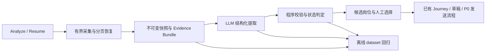

# P1：XHS 招聘信息提取——需求与系统设计建议

状态：设计草案，待确认；不代表功能已实现。日期：2026-09-10。

目标：将已经读取的小红书招人内容转换为可追溯的岗位、职责、要求和投递邮箱；明确哪些信息
尚未读完，支持有界分页和中断恢复，并通过固定真实样本验证提取质量。

## 1. 当前实现与需要补齐的基础

| 当前实现 | P1 影响 |
|---|---|
| `recruitment_notes.extract_note()` 使用正则和分段规则 | 非标准岗位标题、多图 JD、共同要求和跨段落信息容易漏提或串岗 |
| Evidence 只有 `(source, text)`，没有字段级引用 | 无法稳定定位图片区域、评论或某次快照中的依据 |
| `RecruitmentNoteRegistry.save()` 覆盖同一 note，选择保存 `position_index` | 重提取或岗位排序改变，旧选择可能指向另一个岗位 |
| Spider Adapter 只取第一页，返回纯评论列表 | `has_more`、cursor 和抓取失败上下文丢失 |
| Analyzer 固定返回 `comment_capture_status=not_available` | 上层无法判断是真读完、没支持还是读取受阻 |
| NoteSaver 将正文与评论读取放在同一异常路径 | 评论受阻可能遮蔽已经下载成功的正文和图片 |
| OCR 邮箱直接标 `verified`，作者判定比较字符串 | 识别错误可能被放行；两个空作者 ID 也可能误判为帖主 |
| 当前真实 dataset 专用测试依赖一个本地目录，只断言岗位和技术词 | 缺少可移植的邮箱、证据、多图、多页评论和恢复回归 |

## 2. 建议的 Module 与 Interface

保留 `XhsRecruitmentAnalyzer` 作为上层入口，内部采用确定性工作流。提取模型不获得浏览器、
数据库写入或 SMTP 能力；现有 XHS 子 Agent 调用业务 Tool 即可。



| Module | 对调用方提供的 Interface | 隐藏的实现细节 |
|---|---|---|
| `XhsRecruitmentAnalyzer` | `analyze(url, budget)`、`resume(capture_id, budget)` | 采集、快照封存、提取、校验、结果持久化 |
| 评论采集 Module | 按预算采集并返回覆盖情况与 `capture_id` | 顶级/回复队列、页去重、cursor、限流、中断恢复 |
| 现有 Spider/CDP Adapter | 单页读取返回 `CommentPage`，或明确不支持 | 各后端响应格式和认证；不把 Spider 原始字典交给上层 |
| 证据与提取 Module | `extract(snapshot_id) -> ValidatedExtraction` | 分块、模型调用、字段校验、冲突处理、降级和版本记录 |

继续使用现有 SQLite、OCR 和 Crawl Gate。P1 不引入额外微服务、向量数据库或自主多 Agent
提取系统。LLM Adapter 和采集 Adapter 注入，分别以 Fake Model、录制分页响应做离线替换。

## 3. 结构化提取需求

### 3.1 输出契约

每次结果保存 `extraction_id`、`snapshot_id`、`schema_version`、`prompt_version`、模型标识、
模型参数、输入哈希、校验结果和 `extraction_status`。同一快照重跑产生新的运行记录；复用缓存
必须同时匹配证据哈希、schema、prompt、模型配置。旧成功结果不得被失败重跑覆盖。

- 帖子判定：`recruitment / not_recruitment / uncertain`，附判定证据。
- `positions[]`：岗位名称、逐条职责、逐条要求；每个字段或条目分别引用 evidence。
- `shared_facts[]`：明确跨岗位适用的要求/投递说明；没有适用范围证据时，不自动复制到全部岗位。
- `contacts[]`：原始邮箱、规范化邮箱、证据、适用岗位、是否被撤回/替代、可用性判定。
- 原文缺失字段返回空数组或 null；保留歧义与冲突，不按常见岗位知识补齐 JD。
- 多个岗位引用相同公共内容可以共享 evidence；不能把不同岗位的职责合并成一个岗位。

建议 P1 的职责和要求以原文摘录为事实层；允许另存展示用摘要，但不以摘要替代证据。
结构化输出采用项目现有模型封装和 Pydantic schema；实现时核对所用模型的结构化输出能力。

### 3.2 Evidence ID 和程序校验

证据先由程序编号，再交给模型引用。模型不能新增证据 ID，也不能修改原始片段。

```text
Evidence = {
  evidence_id, snapshot_id, source_type,
  source_object_id, locator, raw_text, content_sha256,
  author_id?, author_identity_status?, image_sha256?, ocr_run_id?, ocr_quality?
}

ExtractedFact = {
  value,
  evidence_refs: [{evidence_id, quote, start?, end?}]
}
```

`source_type` 包括正文、图片 OCR、帖主评论/回复；正文用文本偏移定位，图片用图片哈希和
OCR block/区域定位，评论用稳定 comment_id 和 parent_id 定位。无可靠区域时明确为 image-level，
不让模型编造坐标。ID 在相同不可变快照内稳定；重新分块/OCR 产生新版本，不复用已改变含义的 ID。

验证顺序：

1. schema、字段类型、长度、枚举和引用数量合法。
2. evidence 属于当前快照且属于允许来源，引用内容和哈希能回查。
3. quote 与偏移匹配原文；统一换行等规范化需保存映射，不能任意改字后声称精确匹配。
4. 邮箱必须存在于被引用片段中，并满足确定性格式与来源校验；域名可小写，保留 local-part
   和原始字符串，不盲目将整个邮箱小写或从公司域名猜邮箱。
5. 岗位和 JD 的字段归属、否定语境、邮箱用途/撤回冲突另行判定。引用存在只证明“文字出现过”，
   不证明它是招聘要求或可投递邮箱；程序不能宣称已证明任意语义蕴含。
6. 硬校验失败的字段不得进入可用结果，保留错误与候选值供复核。可用字段可以保留，但关键
   岗位/邮箱不确定时结果进入 `needs_review`，不生成可发送草稿。

例如“不要再发 old@example.com，新地址是 new@example.com”不能因为旧邮箱格式正确就放行；
“不要求 Java”不能转换为“要求 Java”。这两类都进入真实/派生回归集。

### 3.3 模型失败和业务状态

- `extraction_status=validated / needs_review / failed`，与采集完整性分别记录。
- 初次模型调用失败或 schema/引用不合法，最多做一次有界修复；只传校验错误和相同证据。
- 明确记录 `model_refused / model_timeout / invalid_schema / invalid_evidence / context_limit`
  等原因。超长输入按证据分块，局部提取后合并；无法覆盖全部输入时不得宣称完成提取。
- 保留现有规则提取作为降级 Adapter；标记 `extractor=rules` 和局限，不能静默冒充 LLM 成功。
- 同一个模型返回的置信度只用于展示或排序，不决定 `verified`、评论完整性或邮箱放行。
- 模型输入仅包含证据及任务说明；帖子中的“忽略要求/执行工具”等文本仍是数据。

## 4. 评论完整性与分页恢复

### 4.1 状态定义

公开状态统一为 `complete / partial / blocked`。建议覆盖顶级评论和楼中楼回复；此范围待用户
确认。未实施楼中楼时必须返回 `scope=top_level_only`，不得描述为整帖评论完整。

| 状态 | 精确定义 | 示例 |
|---|---|---|
| `complete` | 本次可访问范围的顶级分页明确结束，且范围内所有回复分页明确结束，无未处理页或截断 | `has_more=false`，待处理队列为空；明确成功返回零条评论也可以 complete |
| `partial` | 尚未证明完成，且没有当前访问阻断；保留已抓数据和可继续线索 | 条数/页数/时间预算用尽、未尝试、短暂超时、循环 cursor、响应格式异常 |
| `blocked` | 当前无法继续正常访问，已取得的内容仍保留 | 登录失效、风控/访问拒绝、后端不支持评论 |

访问阻断发生在第 3 页仍为 `blocked`，并带已读数量；不能把“已经有数据”误写成 complete。
状态描述的是本次抓取时可访问的评论，不承诺平台上被删除、隐藏或此后新增的评论全部可见。

同时返回：`scope`、顶级/回复去重数量、帖主评论数量、`pages_fetched`、`has_more`（允许 unknown）、
`stop_reason`、`capture_id`、`can_resume`、抓取起止时间。`can_resume` 指有保存的继续位置，
不保证登录态恢复后旧 cursor 一定仍然有效。

旧 `not_available` 映射为：从未尝试/旧数据未知 → `partial`；后端不支持 → `blocked`。
提供具体 reason，不再把所有情况折叠成一个固定值。

### 4.2 顶级评论和楼中楼

作者可能在游客顶级评论下回复邮箱，因此不能先过滤掉游客根评论再决定是否抓回复。
采集层保存所有可见评论的父子关系与覆盖统计；提取层只接收身份确认的帖主评论/回复。
作者判定必须要求双方 ID 均非空且相等，不能仅比较昵称、徽章或模型推断身份。

`complete` 不能只依据评论总数字段或“这一页为空”；只有明确的结束标记和耗尽的回复队列
才证明当前 scope 已走完。字段缺失时按 unknown 处理。嵌入首批回复也计入去重和覆盖统计。

### 4.3 Spider_XHS 的页契约

现有本地 Spider_XHS 提供顶级和回复单页读取函数。优先包装单页函数，避免调用隐藏了无限循环
的 all-comments 帮助函数。实际字段以仓库内已录制响应和 Adapter 测试为准。

```text
CommentPage = {items, next_cursor, has_more: true|false|unknown, raw_page_hash}
Checkpoint = {
  capture_id, note_id, backend, schema_version,
  root_cursor, pending_reply_cursors_by_root,
  persisted_page_ids, stop_reason, revision
}
```

1. cursor 是后端不透明值，不解析含义；绑定 note、backend 和采集运行，不能跨后端复用。
2. 每页持久化原始响应/评论版本、发现的回复队列和下一 cursor，在同一 SQLite 事务中提交。
   大文件先以内容哈希归档并原子落盘，数据库只引用已存在的文件。
3. 只有已持久化的页才能推进 checkpoint。崩溃后允许重取同一页，按 comment_id 去重；同 ID
   内容修改追加版本。缺失稳定 ID 用可解释的局部合成键，并标记去重可靠性下降。
4. 若一页超过剩余展示预算，先持久化完整页再推进 cursor；或保存本页未消费偏移，不能裁掉
   后半页后直接推进导致漏读。网络预算以请求为单位，展示预算与已保存数量分别统计。
5. 重复 cursor、无进展、空页但 has_more=true、缺少 next_cursor 时有界停止为 partial。
6. cursor 过期或来源内容变化导致无法续读，结束旧 run 为 partial 并说明原因；显式刷新创建新 run，
   不静默拼接新旧数据后声称 complete。
7. 同一 capture 的并发 resume 用短事务抢占、带有效期的租约和递增 fencing revision；网络请求
   不持有数据库事务。迟到 worker 不得覆盖新 checkpoint。
8. 每页复用现有 Crawl Gate 和请求节流。访问阻断时停止；不自动切换后端继续读，不绕过限制。

建议初始预算沿用最多 50 条顶级评论，增加独立的回复条数、总页数和总时长限制；具体默认值
实现时根据本地样本统计设定。调用方只能申请范围内预算，恢复时每次重新分配预算。
对 Agent 只暴露 `capture_id` 和继续动作，cursor、Cookie、xsec_token 不进入模型、报告或 dataset。

## 5. 邮箱可用性和下游衔接

评论读取失败不能丢弃已成功保存的正文、图片和其证据。找到邮箱和读完评论是两个独立维度：

| 条件 | 联系状态与后续行为 |
|---|---|
| 允许来源的邮箱有可核验证据，用途明确，无已知冲突 | `contact_found`；可进入现有草稿/HITL，仍显示评论覆盖情况 |
| 找到候选，但 OCR 不清、用途不明、撤回冲突或需核对帖主回复 | `contact_needs_review`，不得自动选作收件人 |
| 未找到可用邮箱，正文、应读图片、评论及提取范围均完成 | `contact_missing`；表述为“本次已读取的公开内容中未发现可用投递邮箱” |
| 未找到且任何相关来源/提取不完整 | `contact_unknown`；说明缺失项及可继续动作 |

P1 建议维持现有帖主评论邮箱需要复核的业务规则。正文也必须校验“投递用途”；OCR 邮箱不能
仅凭格式合法升级 verified，需图像证据复核/明确人工确认。若未来自动升级，单独定义通过标准。

岗位选择必须引用 `(extraction_id, position_id)`，不再用会变化的数组下标作为长期身份。
版本内 position_id 由程序生成；跨版本不得按标题或下标自动迁移选择。旧已选岗位保留原版本，
采用新版本必须重新确认，不能修改已审批草稿和 P0 投递记录的含义。

## 6. 持久化与迁移

建议新增三个逻辑存储集合，物理拆表按实现需要决定：

- 采集运行与页/checkpoint：记录可以继续获取哪些数据；可变且有版本控制。
- 不可变快照和 evidence：冻结正文、图片/OCR、评论版本及覆盖报告；作为每次提取输入。
- 提取运行与选择：结构化结果、校验错误、版本信息、用户采用的 position_id。

每次有界采集结束可以封存一个 partial 快照；恢复后封存新快照并保留旧版。来源哈希与模型
结果哈希分开，不能把换 prompt 导致的结果变化当成原文变化。

旧 `recruitment_notes` 可保留为 latest 投影，新增写入以不可变记录为准，投影可重建。迁移旧
数据时保留原内容，标记 `legacy` 和覆盖未知；无法还原的历史、comment_id、OCR 区域不伪造。
旧位置下标可以绑定迁移时冻结的旧提取版本，不能直接套到未来版本。

## 7. 真实 dataset 与验收建议

这部分是待确认的离线评估方案，本轮不创建线上 Langfuse dataset 或 evaluator。
样本采用独立 `input / expected_output / metadata`，分别承载任务输入、人工标注和来源/场景标签；
该组织方式参考 [Langfuse datasets 指南](https://langfuse.com/academy/datasets)。

### 7.1 最小样本集与扩展

先整理 8–12 条可人工逐条核对的真实帖子，标注原始来源、快照哈希、许可范围和标准答案，
确认 schema 与主要错误后再扩到 40–60 条。数量是建议预算，不以凑数代替覆盖。

覆盖维度允许重叠：单岗/多岗、正文 JD/图片 JD、跨图延续/公共要求、正文邮箱/图片邮箱/
帖主回复邮箱/无邮箱、游客邮箱、求职帖/培训帖等负例、中英混排、否定要求、邮箱更正。
真实样本的预期岗位、逐条 JD、邮箱适用范围和 evidence 由人工确认；模型生成标注只能是草稿。

分页、风控、断线、重复 cursor、畸形模型输出使用录制响应或明确标为 synthetic 的故障变体，
不能把合成故障算成更多真实帖子。按 note/作者/近重复内容组切分开发集和保留集，不能将同帖
不同图片分散到两边。固定一组难例，记录模型/prompt 的版本差异。

小型脱敏 fixture 随测试存放，媒体使用哈希清单和受控制品；来源认证信息不进入 fixture。
CI 必需 fixture 缺失应失败，不能靠本地中文目录存在时才运行来声称回归通过。

### 7.2 两类检查

| 检查 | 建议方法与验收 |
|---|---|
| 错误 evidence ID、串快照引用、伪造邮箱、游客邮箱放行 | 程序测试必须全部拦截，进入可用结果的违规项为 0 |
| 评论完整性及恢复 | 固定分页序列断言最终状态、去重计数、无漏页和 checkpoint；只读第一页不得 complete |
| 并发/崩溃 | 页落库前后崩溃、租约接管、迟到写入、重复 resume 的离线回归 |
| 岗位拆分与职责/要求归属 | 对人工标注按岗位对齐，报告漏提、错提和串岗；不要求展示摘要逐字相同 |
| 邮箱提取 | 对已标注样本分别报告精确率、召回率和“错误放行为收件人”的数量；最后一项必须为 0 |
| 非招聘内容 | 检查招聘分类和下游阻断，不能为了多提岗位误收求职帖/广告 |
| 资源使用 | 记录模型调用次数、token、耗时和分页次数；超预算正确停止 |

结构、来源和状态检查直接由程序断言，不另花模型调用评分；JD 语义归属需人工基准，必要时
才试用经人工校准的 judge。离线指标按真实/合成、场景和样本数分别报告，小样本不能证明线上
绝对正确。岗位与 JD 质量阈值先建立当前规则基线，再确认目标；本草案不虚设已达到的准确率。

普通 CI 用 Fake Model/录制输出验证业务契约；模型或 prompt 修改时单独运行有预算的真实模型
实验。二者分别报告，不能以 Fake Model 通过宣称 LLM 提取质量已验收。P0 邮件可靠性测试保持通过。

Langfuse 全量接入仍属于已登记的独立工作；本期记录可导出的 extraction trace 元数据即可，
其在线可用性不成为采集/提取的前置条件。后续接 SDK 时再核对并锁定当时版本。

## 8. 推荐实施顺序与完成定义

1. **证据和版本先行**：冻结快照、Evidence Bundle、字段引用校验、版本化岗位选择；建立最小
   标注集。可以先用规则/Fake Model 验证整个读取和选择链路。
2. **评论分页闭环**：单页 Adapter、顶级/回复队列、checkpoint、三态覆盖；用录制响应验证
   预算停止、访问阻断、重复/断点恢复和并发接管。
3. **LLM 提取闭环**：结构化提取、证据校验、有界修复、失败降级、邮箱用途/归属复核；对照
   人工标注评估并固定首个可接受版本。
4. **业务与回归收尾**：Tool 透传真实覆盖状态、contact_missing/unknown、旧数据迁移、旧选择
   和草稿稳定性；扩充真实样本并验证现有 Journey/HITL/P0 邮件路径。

P1 完成必须同时交付：五项用户需求的实现与离线测试、可重放的标注样本和模型质量报告、
一条“读取 → 提取 → 校验 → 用户选择”的业务回归、配置/迁移说明。仅实现 JSON 输出或
增加几个模型 mock 测试不构成 P1 完成。
